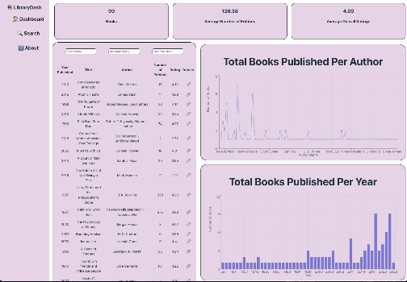

# Library Dashboard Part 2
Library Dashboard Part 2 provides an at-a-glance summary of information gathered from a public API.

Users will be able to view: 
- a summary of statistics
- a list view of the data that can be searched and filtered
- data visualizations of data
- a detail view containing more info related to a given data point

**The following **required** functionality is completed:**

- [x] Clicking on an item in the list view displays more details about it

- [x] Each detail view of an item has a direct, unique link to that item’s page

- [x] The app includes at least two unique charts developed using the fetched data

**The following **optional** functionality are implemented:**
- [ ] The site’s customized dashboard contains more content that explains what is interesting about the data

- [ ] The site allows users to toggle between different data visualizations

# Here's how Data Dashboard Part 2 looks:



# Getting started
**Install dependencies**
```
npm install
```

**Run the application in developer mode**

```
npm run dev
```

**Install navigation and chart functionality**

```
npm install react-router-dom

npm install recharts
```

**Open project in the browser**

In the command line Vite will display a link, such as http://127.0.0.1:5173 to click on or copy/paste that will take you to the localhost port where the project is running.

**Tip:** If you'd like to stop the server, you can use ctrl + c or cmd + c within the Terminal, or use the trash can icon in the top right of the Terminal within VS Code. To run the server again, simply use npm run dev again.